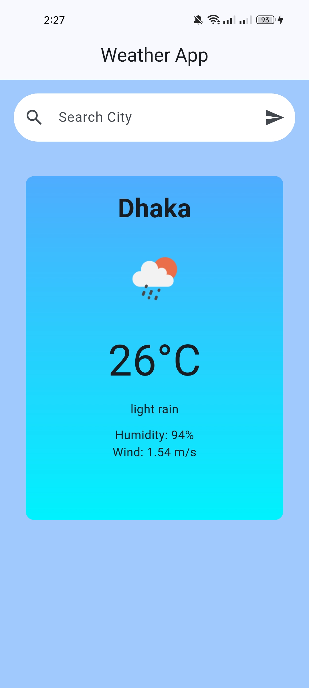
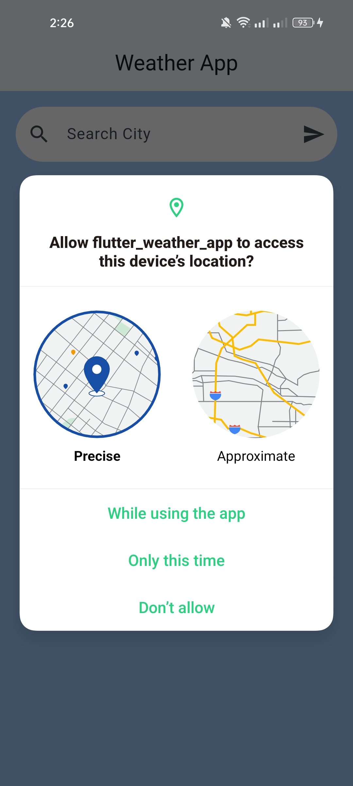
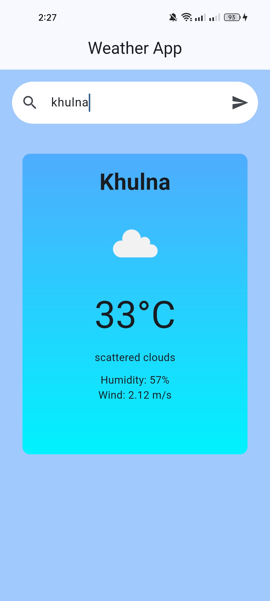

# Flutter Weather App

A simple and elegant Flutter weather application that shows current weather conditions for a searched city or the user's current location using OpenWeatherMap API.

## Features

- Search weather by city name
- Get current weather based on device location
- View temperature, humidity, wind speed, and weather description
- Modern UI with gradient weather card
- Loading and error handling for API and location permission states
- Clean Material Design interface

## Tech Stack

- Flutter
- Dart
- OpenWeatherMap API
- Geolocator
- Permission Handler
- HTTP

## Screenshots

### App home / default weather

### Initial screen

### Search weather result

## Getting Started

1. Install Flutter SDK from the official Flutter documentation.
2. Clone the repository:

   git clone https://github.com/yourusername/flutter_weather_app.git

3. Navigate to the project folder:

   cd flutter_weather_app

4. Install dependencies:

   flutter pub get

5. Run the app:

   flutter run

## Notes

This app uses the OpenWeatherMap API and requires a valid API key configured in the weather service file for live weather data.

## Project Structure

- lib/main.dart - App entry point
- lib/pages/home_page.dart - Main weather UI
- lib/service/weather_service.dart - API calls to OpenWeatherMap
- lib/service/location_service.dart - Location permission and GPS handling
- lib/model/weather_model.dart - Weather data model
